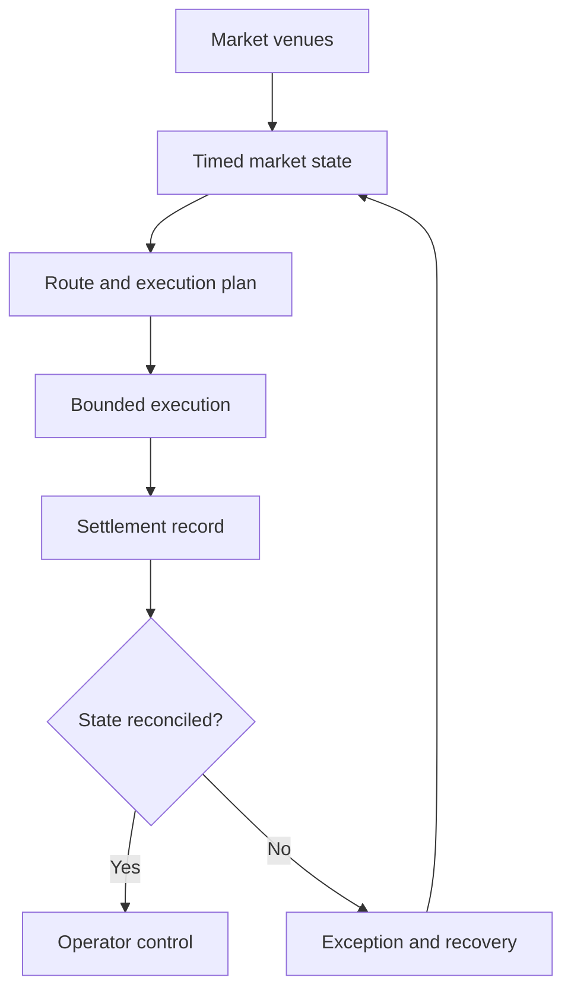

[← J0UH profile](https://github.com/J0UH)

# Exchange and market infrastructure

Work across exchanges, routing, liquidity, and the systems that help people understand what happened to a trade.

An exchange compresses a lot of moving parts into a small interaction. Behind a quote are venues, balances, liquidity, and assumptions about time. Those assumptions can change while someone is deciding what to do.

My work here spans decentralised exchanges, centralised exchange platforms, and the services around them. Some pieces were built directly. Others involved understanding established open-source systems and adapting them to a different product and operating environment.

## Following a trade beyond the button

I keep quoted, submitted, executed, and settled state distinct. Each tells a different part of the story. Combining them into one reassuring status makes it harder to explain a delay or recover from a disagreement between systems.

The routing and data layers need the same care. A quote should carry its assumptions; a derived market view should retain its source and timing. Operators then have something solid to use when reconciling the result.

This area is a good example of why I like working across a whole system. The interface, protocol integration, and operator tools all influence whether the product makes sense.

A closer look at the technical flow

## Explore the projects

- [Decentralised exchange platform](https://github.com/J0UH/dex-platform): Swap interfaces, protocol integration, transaction state, and liquidity-aware product design.
- [Smart order routing](https://github.com/J0UH/smart-order-routing): Route discovery, quote comparison, execution planning, and reusable market SDKs.
- [Market data and indexing](https://github.com/J0UH/market-data-indexing): Event-derived market state, subgraphs, analytics, and data products for exchange systems.
- [Limit order infrastructure](https://github.com/J0UH/limit-order-infrastructure): Signed orders, relay services, indexed state, expiry, and execution visibility.
- [CEX and DAX platform adaptation](https://github.com/J0UH/cex-platform-adaptation): Architecture and adaptation of open-source centralised and digital-asset exchange platforms.
- [Multi-asset money platform](https://github.com/J0UH/multi-asset-money-platform): A modular product surface for issuing, managing, swapping, and integrating digital assets.
- [Trading and treasury automation](https://github.com/J0UH/trading-treasury-automation): Controlled market and treasury workflows with explicit risk, evidence, and operator authority.

Working on a similar problem? [Tell me what you are building](mailto:ju@jomena.group?subject=Exchange%20and%20market%20infrastructure).

*This is a public account of the work. Source code and private operating details are not included in this repository.*
