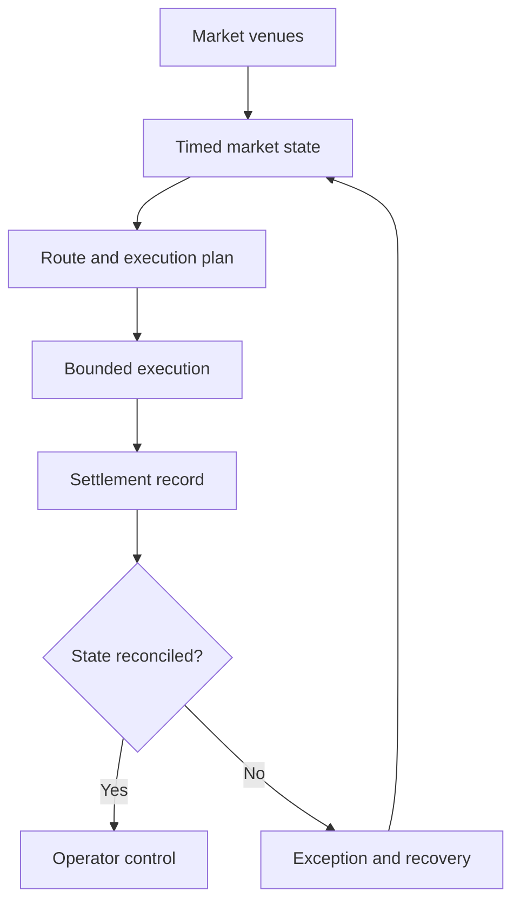

[← Profile](https://github.com/J0UH)

# Exchange and market infrastructure

Quote to settlement across venues, routes, and liquidity — interfaces and operator tools that explain each step and recover when systems disagree.

*Professional work on exchange and market systems. Implementation stays with the companies that own it — [about these pages](https://github.com/J0UH/J0UH/blob/main/ABOUT.md).*

## Problem

An exchange compresses venues, balances, liquidity, and timing assumptions into a small interaction. Those assumptions can change while someone is still deciding. Operators need a solid story when systems disagree — not one reassuring status that hides the delay.

## What I built

Work across decentralised and centralised exchange platforms and the services around them: routing, market data and indexing, limit-order infrastructure, treasury automation, and the control surfaces that follow a trade past the button. Some pieces were built directly; others adapted established open-source systems to a different product and operating environment.

## Key decisions

- **Keep quoted, submitted, executed, and settled state distinct.** Each tells a different part of the story. Mixing them makes delays and disagreements harder to explain.
- **Quotes carry assumptions; derived views keep source and timing.** Routing and data layers should leave operators something solid to reconcile against.
- **Interface, protocol, and operator tools are one product.** The trade only makes sense when all three stay honest about what happened.

## Architecture

## What the work covers

- Decentralised and centralised exchange surfaces
- Smart order routing and quote comparison
- Market data, indexing, and derived views
- Limit-order and relay infrastructure
- Trading and treasury automation with explicit authority
- Operator recovery when settlement and market state disagree

## Related work

- [MoneyOS](https://github.com/J0UH/moneyos-platform)
- [Stablecoin and programmable asset infrastructure](https://github.com/J0UH/stablecoin-infrastructure)
- [Open finance and payments](https://github.com/J0UH/open-finance-payments)

Working on a similar problem? [Tell me what you are building](mailto:ju@jomena.group?subject=Exchange%20and%20market%20infrastructure).
