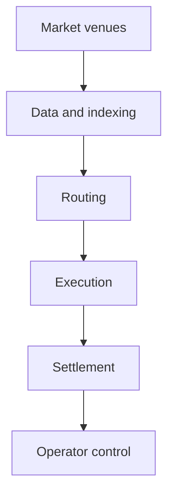

  

# Exchange and market infrastructure

I have worked across decentralised exchanges, centralised exchange platforms, digital-asset exchange stacks, routing, liquidity, market data, and the operator systems around them. Sometimes that meant building a system directly. Sometimes it meant understanding a large open-source platform, adapting it, and orchestrating the pieces into a product that fit the job.

[Reach out](mailto:ju@jomena.group?subject=Discuss%20Exchange%20and%20market%20infrastructure) | [Book a technical call](mailto:ju@jomena.group?subject=Book%20a%20technical%20call%20about%20Exchange%20and%20market%20infrastructure)

## The engineering problem

Markets are distributed systems with financial consequences. Quotes age, liquidity moves, providers disagree, transactions settle later, and operators still need one coherent account of what happened.

## Systems and project pages

| Project | What it covers |
| --- | --- |
| [Decentralised exchange platform](https://github.com/J0UH/dex-platform) | Swap interfaces, protocol integration, transaction state, and liquidity-aware product design. |
| [Smart order routing](https://github.com/J0UH/smart-order-routing) | Route discovery, quote comparison, execution planning, and reusable market SDKs. |
| [Market data and indexing](https://github.com/J0UH/market-data-indexing) | Event-derived market state, subgraphs, analytics, and data products for exchange systems. |
| [Limit order infrastructure](https://github.com/J0UH/limit-order-infrastructure) | Signed orders, relay services, indexed state, expiry, and execution visibility. |
| [CEX and DAX platform adaptation](https://github.com/J0UH/cex-platform-adaptation) | Architecture and adaptation of open-source centralised and digital-asset exchange platforms. |
| [Multi-asset money platform](https://github.com/J0UH/multi-asset-money-platform) | A modular product surface for issuing, managing, swapping, and integrating digital assets. |
| [Trading and treasury automation](https://github.com/J0UH/trading-treasury-automation) | Controlled market and treasury workflows with explicit risk, evidence, and operator authority. |

## How the pieces fit

## Principles that carry across the work

- Keep quoted, submitted, executed, and settled state distinct.
- Attach assumptions and source time to market data.
- Model recovery and reconciliation before scaling volume.
- Credit upstream protocols while owning the adaptation work.
- Design the operator view as part of the market system.

Built under the Aryze umbrella. The underlying source and company IP remain private and owned by Aryze. Delivery involved people across engineering, product, operations, compliance, and design. Open-source foundations retain their original attribution and licences.

## Talk through a similar problem

[Tell me what you are building](mailto:ju@jomena.group?subject=I%20am%20building%20something%20in%20Exchange%20and%20market%20infrastructure) or [book a technical call](mailto:ju@jomena.group?subject=Book%20a%20technical%20call%20about%20Exchange%20and%20market%20infrastructure). A fuller portfolio site is in preparation.
